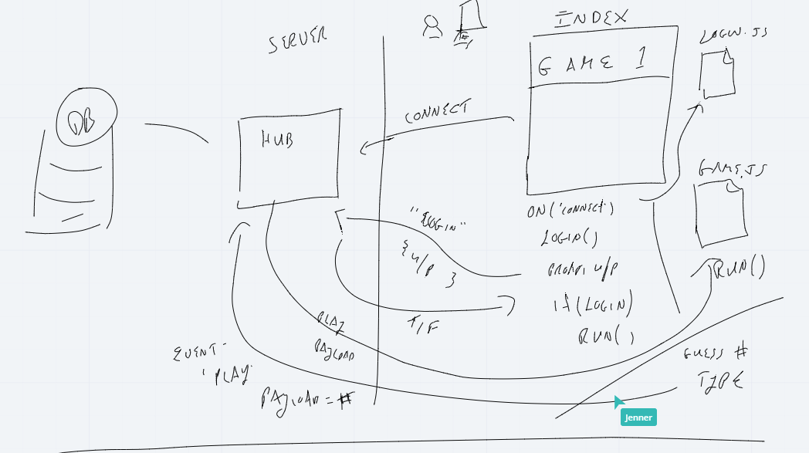
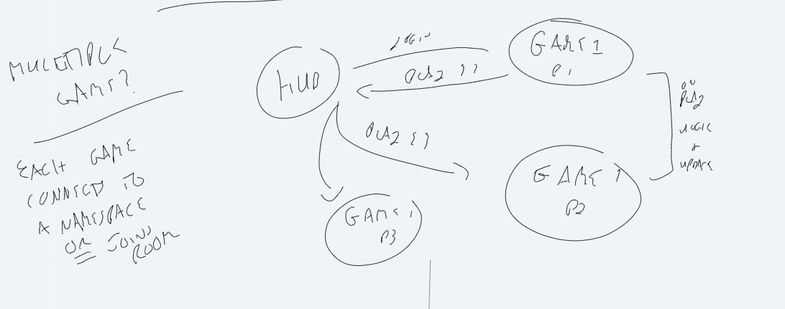
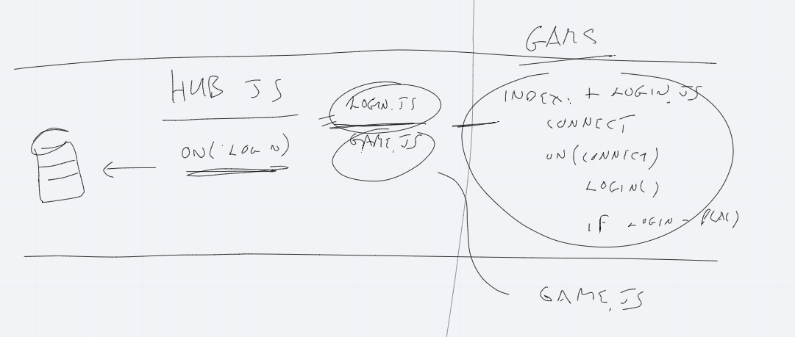

# requirements

- `"@code-fellows/supergoose": "^1.1.0"`
- `"base-64": "^1.0.0"`
- `"bcrypt": "^5.0.1"`
- `"chalk": "^4.1.1"`
- `"dotenv": "^8.2.0"`
- `"express": "^4.17.1"`
- `"jest": "^26.6.3"`
- `"mongoose": "^5.12.7"`
- `"readline": "^1.3.0"`
- `"repl": "^0.1.3"`
- `"socket.io": "^4.0.1"`
- `"socket.io-client": "^4.0.1"`

## [Wireframe ](https://miro.com/app/board/o9J_lIOTDIw=/?moveToWidget=3074457358291561544&cot=14)

## [User Stories](https://docs.google.com/document/d/1d6HvZM9v-zSnVJIhHfaVVuOr03jaYJIHcZDwWnwsrwM/edit?usp=sharing)

## Domain Model

