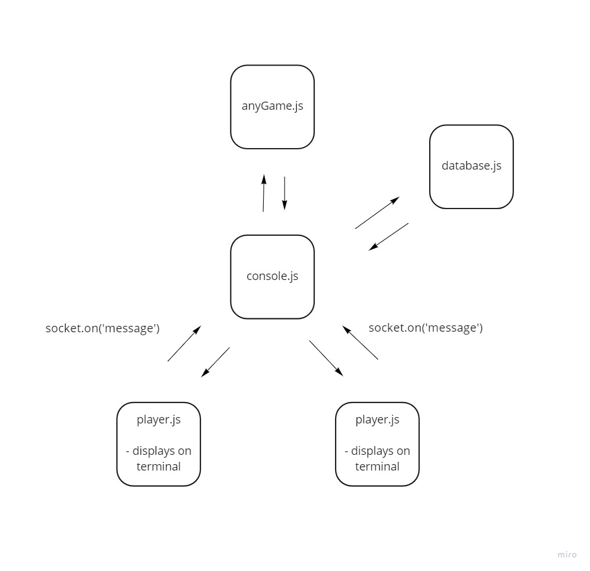

# requirements

- `ngrok`
- `socket.io`
- `socket.io-client`
- `node`
- `.env`
- `base-64`
- `chalk`

## [Wirefrrame ](https://miro.com/app/board/o9J_lIOTDIw=/?moveToWidget=3074457358291561544&cot=14)

## [User Stories](https://docs.google.com/document/d/1d6HvZM9v-zSnVJIhHfaVVuOr03jaYJIHcZDwWnwsrwM/edit?usp=sharing)

## Domain Model

- 
